# Huellas de Paz — Diagramas UML (Sistema Completo)

> Renderizar con la extensión **Mermaid** en VS Code (`bierner.markdown-mermaid`) → `Ctrl+Shift+V`,
> o pegando cada bloque en [mermaid.live](https://mermaid.live)

---

## 1. Diagrama de Casos de Uso — Sistema Completo

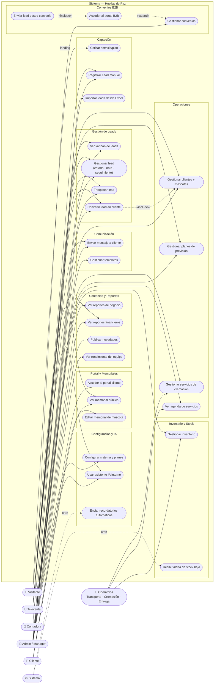
```mermaid
flowchart LR
    V(["👤 Visitante"])
    TV(["👤 Televenta"])
    OP(["👤 Operativos\nTransporte · Cremación · Entrega"])
    CO(["👤 Contadora"])
    AM(["👤 Admin / Manager"])
    CLI(["👤 Cliente"])
    SYS(["⚙️ Sistema"])

    subgraph HP ["Sistema — Huellas de Paz"]

        subgraph CAN ["Captación"]
            UC1(["Cotizar servicio/plan"])
            UC2(["Registrar Lead manual"])
            UC3(["Importar leads desde Excel"])
        end

        subgraph GL ["Gestión de Leads"]
            UC4(["Ver kanban de leads"])
            UC5(["Gestionar lead\n(estado · nota · seguimiento)"])
            UC6(["Traspasar lead"])
            UC7(["Convertir lead en cliente"])
        end

        subgraph OPS ["Operaciones"]
            UC8(["Gestionar clientes y mascotas"])
            UC9(["Gestionar servicios de cremación"])
            UC10(["Gestionar planes de previsión"])
            UC11(["Ver agenda de servicios"])
        end

        subgraph B2B ["Convenios B2B"]
            UC12(["Gestionar convenios"])
            UC13(["Acceder al portal B2B"])
            UC14(["Enviar lead desde convenio"])
        end

        subgraph INV ["Inventario y Stock"]
            UC15(["Gestionar inventario"])
            UC16(["Recibir alerta de stock bajo"])
        end

        subgraph COM ["Comunicación"]
            UC17(["Enviar mensaje a cliente"])
            UC18(["Gestionar templates"])
        end

        subgraph PORT ["Portal y Memoriales"]
            UC19(["Acceder al portal cliente"])
            UC20(["Editar memorial de mascota"])
            UC21(["Ver memorial público"])
        end

        subgraph CONT ["Contenido y Reportes"]
            UC22(["Ver reportes de negocio"])
            UC23(["Ver reportes financieros"])
            UC24(["Publicar novedades"])
            UC25(["Ver rendimiento del equipo"])
        end

        subgraph CFG ["Configuración y IA"]
            UC26(["Configurar sistema y planes"])
            UC27(["Usar asistente IA interno"])
            UC28(["Enviar recordatorios automáticos"])
        end

    end

    V -->|"landing"| UC1
    V --> UC21
    TV --> UC2
    TV --> UC4
    TV --> UC5
    TV --> UC6
    TV --> UC7
    TV --> UC8
    TV --> UC10
    TV --> UC17
    TV --> UC27
    OP --> UC9
    OP --> UC11
    OP --> UC15
    CO --> UC23
    AM --> UC2
    AM --> UC3
    AM --> UC4
    AM --> UC5
    AM --> UC6
    AM --> UC7
    AM --> UC8
    AM --> UC9
    AM --> UC10
    AM --> UC11
    AM --> UC12
    AM --> UC15
    AM --> UC17
    AM --> UC18
    AM --> UC22
    AM --> UC23
    AM --> UC24
    AM --> UC25
    AM --> UC26
    AM --> UC27
    CLI --> UC19
    CLI --> UC20
    CLI --> UC21
    SYS -. "cron" .-> UC28
    SYS -. "cron" .-> UC16
    UC13 -. "«extend»" .-> UC12
    UC14 -. "«include»" .-> UC13
    UC7 -. "«include»" .-> UC8
```

### Roles del sistema

| Rol | Acceso principal |
|---|---|
| **admin** | Todo el sistema |
| **manager** | Reportes, rendimiento del equipo, leads |
| **contadora** | Reportes financieros, cobranzas |
| **televenta** | Leads, clientes, planes, comunicación |
| **transporte** | Agenda, servicios asignados (retiro) |
| **cremacion** | Servicios en proceso de cremación |
| **entrega** | Servicios listos para entregar |

---

## 2. Diagrama de Clases — Sistema Completo

### 2a. Entidades de Negocio (Core)

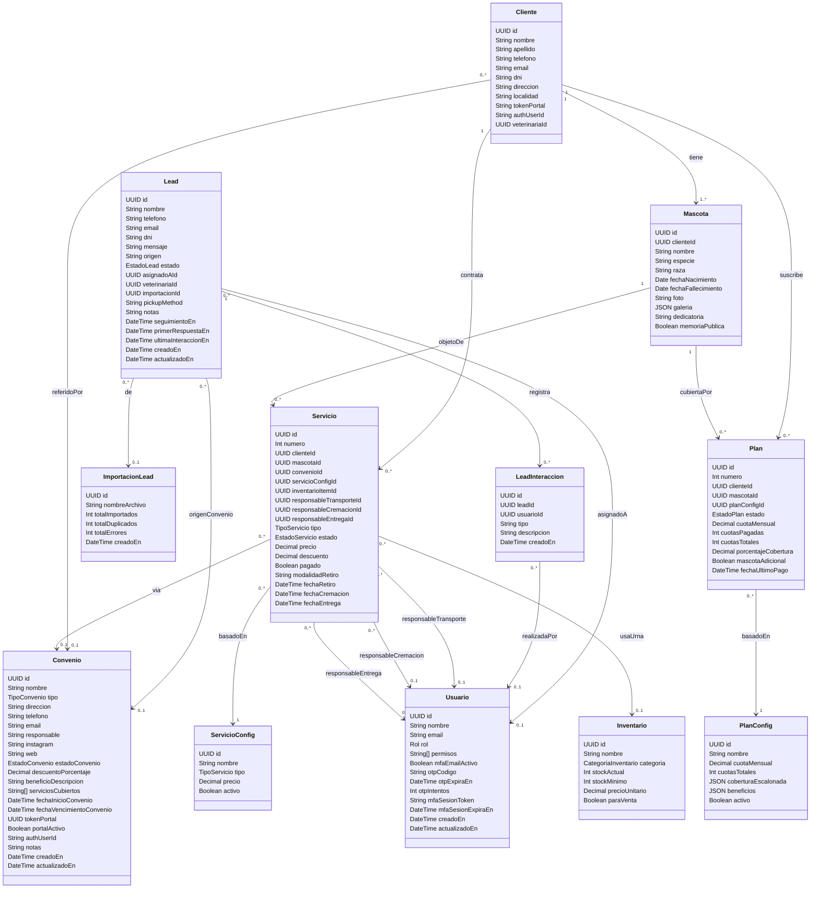
```mermaid
classDiagram
    class Usuario {
        UUID id
        String nombre
        String email
        Rol rol
        String[] permisos
        Boolean mfaEmailActivo
        String otpCodigo
        DateTime otpExpiraEn
        Int otpIntentos
        String mfaSesionToken
        DateTime mfaSesionExpiraEn
        DateTime creadoEn
        DateTime actualizadoEn
    }

    class Lead {
        UUID id
        String nombre
        String telefono
        String email
        String dni
        String mensaje
        String origen
        EstadoLead estado
        UUID asignadoAId
        UUID veterinariaId
        UUID importacionId
        String pickupMethod
        String notas
        DateTime seguimientoEn
        DateTime primerRespuestaEn
        DateTime ultimaInteraccionEn
        DateTime creadoEn
        DateTime actualizadoEn
    }

    class LeadInteraccion {
        UUID id
        UUID leadId
        UUID usuarioId
        String tipo
        String descripcion
        DateTime creadoEn
    }

    class ImportacionLead {
        UUID id
        String nombreArchivo
        Int totalImportados
        Int totalDuplicados
        Int totalErrores
        DateTime creadoEn
    }

    class Cliente {
        UUID id
        String nombre
        String apellido
        String telefono
        String email
        String dni
        String direccion
        String localidad
        String tokenPortal
        String authUserId
        UUID veterinariaId
    }

    class Mascota {
        UUID id
        UUID clienteId
        String nombre
        String especie
        String raza
        Date fechaNacimiento
        Date fechaFallecimiento
        String foto
        JSON galeria
        String dedicatoria
        Boolean memoriaPublica
    }

    class Servicio {
        UUID id
        Int numero
        UUID clienteId
        UUID mascotaId
        UUID convenioId
        UUID servicioConfigId
        UUID inventarioItemId
        UUID responsableTransporteId
        UUID responsableCremacionId
        UUID responsableEntregaId
        TipoServicio tipo
        EstadoServicio estado
        Decimal precio
        Decimal descuento
        Boolean pagado
        String modalidadRetiro
        DateTime fechaRetiro
        DateTime fechaCremacion
        DateTime fechaEntrega
    }

    class ServicioConfig {
        UUID id
        String nombre
        TipoServicio tipo
        Decimal precio
        Boolean activo
    }

    class Plan {
        UUID id
        Int numero
        UUID clienteId
        UUID mascotaId
        UUID planConfigId
        EstadoPlan estado
        Decimal cuotaMensual
        Int cuotasPagadas
        Int cuotasTotales
        Decimal porcentajeCobertura
        Boolean mascotaAdicional
        DateTime fechaUltimoPago
    }

    class PlanConfig {
        UUID id
        String nombre
        Decimal cuotaMensual
        Int cuotasTotales
        JSON coberturaEscalonada
        JSON beneficios
        Boolean activo
    }

    class Convenio {
        UUID id
        String nombre
        TipoConvenio tipo
        String direccion
        String telefono
        String email
        String responsable
        String instagram
        String web
        EstadoConvenio estadoConvenio
        Decimal descuentoPorcentaje
        String beneficioDescripcion
        String[] serviciosCubiertos
        DateTime fechaInicioConvenio
        DateTime fechaVencimientoConvenio
        UUID tokenPortal
        Boolean portalActivo
        String authUserId
        String notas
        DateTime creadoEn
        DateTime actualizadoEn
    }

    class Inventario {
        UUID id
        String nombre
        CategoriaInventario categoria
        Int stockActual
        Int stockMinimo
        Decimal precioUnitario
        Boolean paraVenta
    }

    Lead "0..*" --> "0..1" Usuario : asignadoA
    Lead "0..*" --> "0..1" Convenio : origenConvenio
    Lead "0..*" --> "0..1" ImportacionLead : de
    Lead "1" --> "0..*" LeadInteraccion : registra
    LeadInteraccion "0..*" --> "0..1" Usuario : realizadaPor
    Cliente "0..*" --> "0..1" Convenio : referidoPor
    Cliente "1" --> "1..*" Mascota : tiene
    Cliente "1" --> "0..*" Servicio : contrata
    Cliente "1" --> "0..*" Plan : suscribe
    Mascota "1" --> "0..*" Servicio : objetoDe
    Mascota "1" --> "0..*" Plan : cubiertaPor
    Servicio "0..*" --> "1" ServicioConfig : basadoEn
    Servicio "0..*" --> "0..1" Convenio : via
    Servicio "0..*" --> "0..1" Inventario : usaUrna
    Servicio "0..*" --> "0..1" Usuario : responsableTransporte
    Servicio "0..*" --> "0..1" Usuario : responsableCremacion
    Servicio "0..*" --> "0..1" Usuario : responsableEntrega
    Plan "0..*" --> "1" PlanConfig : basadoEn
```

### 2b. Entidades de Soporte

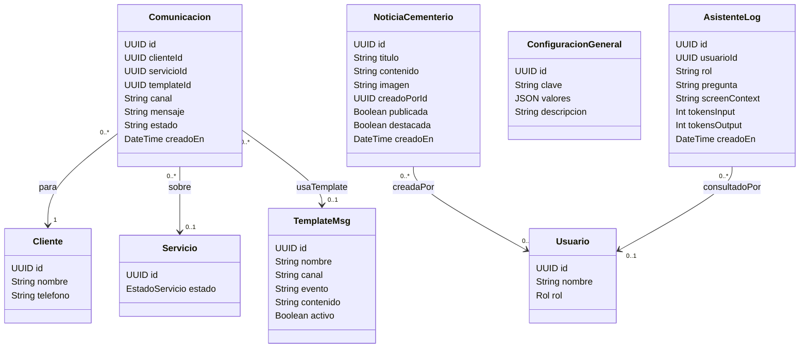
```mermaid
classDiagram
    class Usuario {
        UUID id
        String nombre
        Rol rol
    }

    class Cliente {
        UUID id
        String nombre
        String telefono
    }

    class Servicio {
        UUID id
        EstadoServicio estado
    }

    class Comunicacion {
        UUID id
        UUID clienteId
        UUID servicioId
        UUID templateId
        String canal
        String mensaje
        String estado
        DateTime creadoEn
    }

    class TemplateMsg {
        UUID id
        String nombre
        String canal
        String evento
        String contenido
        Boolean activo
    }

    class NoticiaCementerio {
        UUID id
        String titulo
        String contenido
        String imagen
        UUID creadoPorId
        Boolean publicada
        Boolean destacada
        DateTime creadoEn
    }

    class ConfiguracionGeneral {
        UUID id
        String clave
        JSON valores
        String descripcion
    }

    class AsistenteLog {
        UUID id
        UUID usuarioId
        String rol
        String pregunta
        String screenContext
        Int tokensInput
        Int tokensOutput
        DateTime creadoEn
    }

    Comunicacion "0..*" --> "1" Cliente : para
    Comunicacion "0..*" --> "0..1" Servicio : sobre
    Comunicacion "0..*" --> "0..1" TemplateMsg : usaTemplate
    NoticiaCementerio "0..*" --> "0..1" Usuario : creadaPor
    AsistenteLog "0..*" --> "0..1" Usuario : consultadoPor
```

### Enumeraciones

| Tipo | Valores |
|---|---|
| **EstadoLead** | `nuevo` · `contactado` · `interesado` · `cotizado` · `convertido` · `perdido` |
| **EstadoServicio** | `pendiente` · `en_proceso` · `listo` · `entregado` · `cancelado` |
| **TipoServicio** | `cremacion_individual` · `cremacion_comunitaria` · `entierro` |
| **EstadoPlan** | `activo` · `pausado` · `atrasado` · `utilizado` · `cancelado` |
| **EstadoConvenio** | `sin_convenio` · `en_negociacion` · `activo` · `pausado` |
| **TipoConvenio** | `veterinaria` · `petshop` · `refugio` · `clinica` · `otro` |
| **CategoriaInventario** | `urna` · `bolsa` · `caja` · `accesorio` · `insumo` · `otro` |
| **Rol** | `admin` · `manager` · `contadora` · `televenta` · `transporte` · `cremacion` · `entrega` |

---

## 3. Diagramas de Actividad

### 3a. Captación via Cotizador

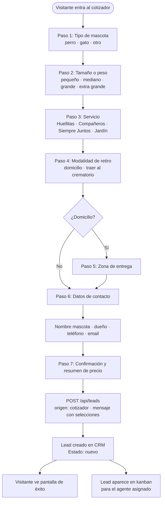
```mermaid
flowchart TD
    A([Visitante entra al cotizador]) --> B[Paso 1: Tipo de mascota\nperro · gato · otro]
    B --> C[Paso 2: Tamaño o peso\npequeño · mediano · grande · extra grande]
    C --> D[Paso 3: Servicio\nHuellitas · Compañeros · Siempre Juntos · Jardín]
    D --> E[Paso 4: Modalidad de retiro\ndomicilio · traer al crematorio]
    E --> F{¿Domicilio?}
    F -->|Sí| G[Paso 5: Zona de entrega]
    F -->|No| H[Paso 6: Datos de contacto]
    G --> H
    H --> I[Nombre mascota · dueño · teléfono · email]
    I --> J[Paso 7: Confirmación y resumen de precio]
    J --> K[POST /api/leads\norigen: cotizador · mensaje con selecciones]
    K --> L[Lead creado en CRM\nEstado: nuevo]
    L --> M[Visitante ve pantalla de éxito]
    L --> N[Lead aparece en kanban\npara el agente asignado]
```

### 3b. Captación via Landing (Formulario de Contacto)

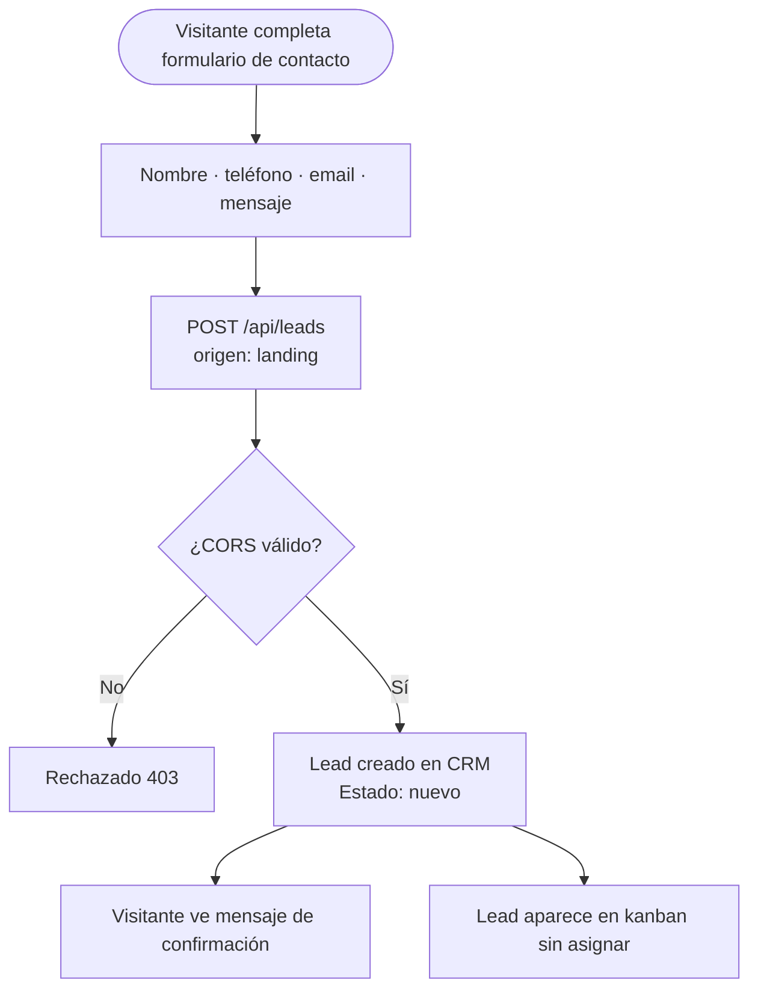
```mermaid
flowchart TD
    A([Visitante completa formulario de contacto]) --> B[Nombre · teléfono · email · mensaje]
    B --> C[POST /api/leads\norigen: landing]
    C --> D{¿CORS válido?}
    D -->|No| E[Rechazado 403]
    D -->|Sí| F[Lead creado en CRM\nEstado: nuevo]
    F --> G[Visitante ve mensaje de confirmación]
    F --> H[Lead aparece en kanban sin asignar]
```

### 3c. Importación Masiva de Leads

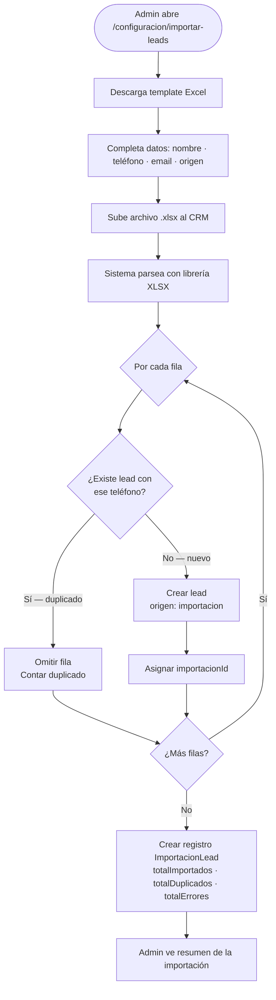
```mermaid
flowchart TD
    A([Admin abre /configuracion/importar-leads]) --> B[Descarga template Excel]
    B --> C[Completa datos: nombre · teléfono · email · origen]
    C --> D[Sube archivo .xlsx al CRM]
    D --> E[Sistema parsea con librería XLSX]
    E --> F{Por cada fila}
    F --> G{¿Existe lead con\nese teléfono?}
    G -->|Sí — duplicado| H[Omitir fila\nContar duplicado]
    G -->|No — nuevo| I[Crear lead\norigen: importacion]
    I --> J[Asignar importacionId]
    H --> K{¿Más filas?}
    J --> K
    K -->|Sí| F
    K -->|No| L[Crear registro ImportacionLead\ntotalImportados · totalDuplicados · totalErrores]
    L --> M[Admin ve resumen de la importación]
```

### 3d. Ciclo de Vida de un Lead

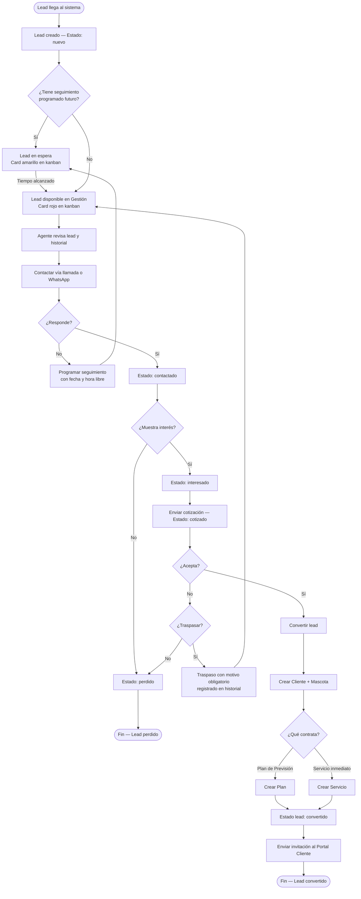
```mermaid
flowchart TD
    A([Lead llega al sistema]) --> B[Lead creado — Estado: nuevo]
    B --> C{¿Tiene seguimiento\nprogramado futuro?}
    C -->|Sí| D[Lead en espera\nCard amarillo en kanban]
    D -->|Tiempo alcanzado| E[Lead disponible en Gestión\nCard rojo en kanban]
    C -->|No| E
    E --> F[Agente revisa lead y historial]
    F --> G[Contactar vía llamada o WhatsApp]
    G --> H{¿Responde?}
    H -->|No| I[Programar seguimiento\ncon fecha y hora libre]
    I --> D
    H -->|Sí| J[Estado: contactado]
    J --> K{¿Muestra interés?}
    K -->|No| L[Estado: perdido]
    L --> ENDP([Fin — Lead perdido])
    K -->|Sí| M[Estado: interesado]
    M --> N[Enviar cotización — Estado: cotizado]
    N --> O{¿Acepta?}
    O -->|No| P{¿Traspasar?}
    P -->|Sí| Q[Traspaso con motivo obligatorio\nregistrado en historial]
    Q --> E
    P -->|No| L
    O -->|Sí| R[Convertir lead]
    R --> S[Crear Cliente + Mascota]
    S --> T{¿Qué contrata?}
    T -->|Plan de Previsión| U[Crear Plan]
    T -->|Servicio inmediato| V[Crear Servicio]
    U --> W[Estado lead: convertido]
    V --> W
    W --> X[Enviar invitación al Portal Cliente]
    X --> ENDC([Fin — Lead convertido])
```

### 3e. Servicio de Cremación / Entierro

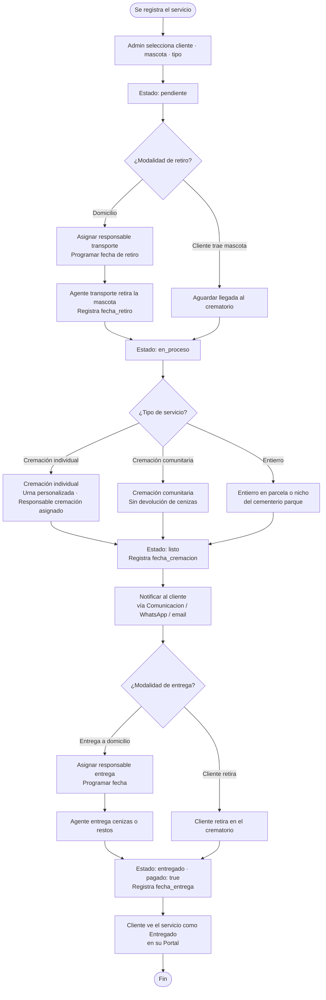
```mermaid
flowchart TD
    A([Se registra el servicio]) --> B[Admin selecciona cliente · mascota · tipo]
    B --> C[Estado: pendiente]
    C --> D{¿Modalidad de retiro?}
    D -->|Domicilio| E[Asignar responsable transporte\nProgramar fecha de retiro]
    D -->|Cliente trae mascota| F[Aguardar llegada al crematorio]
    E --> G[Agente transporte retira la mascota\nRegistra fecha_retiro]
    G --> H[Estado: en_proceso]
    F --> H
    H --> I{¿Tipo de servicio?}
    I -->|Cremación individual| J[Cremación individual\nUrna personalizada · Responsable cremación asignado]
    I -->|Cremación comunitaria| K[Cremación comunitaria\nSin devolución de cenizas]
    I -->|Entierro| L[Entierro en parcela o nicho\ndel cementerio parque]
    J --> M[Estado: listo\nRegistra fecha_cremacion]
    K --> M
    L --> M
    M --> N[Notificar al cliente\nvía Comunicacion / WhatsApp / email]
    N --> O{¿Modalidad de entrega?}
    O -->|Entrega a domicilio| P[Asignar responsable entrega\nProgramar fecha]
    O -->|Cliente retira| Q[Cliente retira en el crematorio]
    P --> R[Agente entrega cenizas o restos]
    R --> S[Estado: entregado · pagado: true\nRegistra fecha_entrega]
    Q --> S
    S --> T[Cliente ve el servicio como Entregado\nen su Portal]
    T --> END([Fin])
```

### 3f. Plan de Previsión

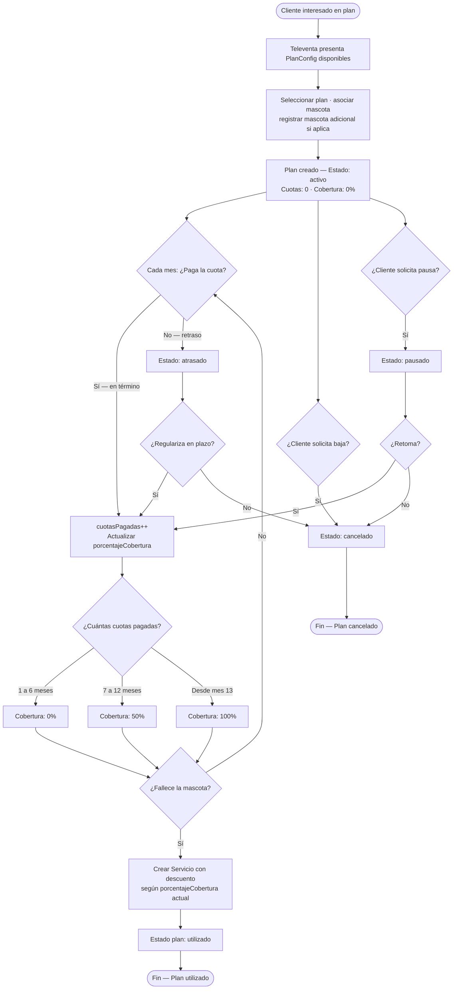
```mermaid
flowchart TD
    A([Cliente interesado en plan]) --> B[Televenta presenta PlanConfig disponibles]
    B --> C[Seleccionar plan · asociar mascota\nregistrar mascota adicional si aplica]
    C --> D[Plan creado — Estado: activo\nCuotas: 0 · Cobertura: 0%]
    D --> E{Cada mes: ¿Paga la cuota?}
    E -->|Sí — en término| F[cuotasPagadas++\nActualizar porcentajeCobertura]
    E -->|No — retraso| G[Estado: atrasado]
    G --> H{¿Regulariza en plazo?}
    H -->|Sí| F
    H -->|No| I[Estado: cancelado]
    I --> ENDC([Fin — Plan cancelado])
    F --> J{¿Cuántas cuotas pagadas?}
    J -->|1 a 6 meses| K[Cobertura: 0%]
    J -->|7 a 12 meses| L[Cobertura: 50%]
    J -->|Desde mes 13| M[Cobertura: 100%]
    K --> N{¿Fallece la mascota?}
    L --> N
    M --> N
    N -->|No| E
    N -->|Sí| O[Crear Servicio con descuento\nsegún porcentajeCobertura actual]
    O --> P[Estado plan: utilizado]
    P --> ENDU([Fin — Plan utilizado])
    D --> Q{¿Cliente solicita baja?}
    Q -->|Sí| I
    D --> R{¿Cliente solicita pausa?}
    R -->|Sí| S[Estado: pausado]
    S --> T{¿Retoma?}
    T -->|Sí| F
    T -->|No| I
```

### 3g. Comunicaciones con el Cliente

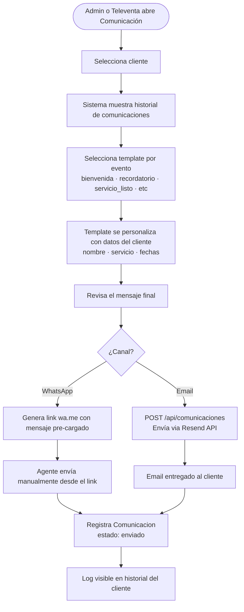
```mermaid
flowchart TD
    A([Admin o Televenta abre Comunicación]) --> B[Selecciona cliente]
    B --> C[Sistema muestra historial de comunicaciones]
    C --> D[Selecciona template por evento\nbienvenida · recordatorio · servicio_listo · etc]
    D --> E[Template se personaliza con datos del cliente\nnombre · servicio · fechas]
    E --> F[Revisa el mensaje final]
    F --> G{¿Canal?}
    G -->|WhatsApp| H[Genera link wa.me con mensaje pre-cargado]
    G -->|Email| I[POST /api/comunicaciones\nEnvía via Resend API]
    H --> J[Agente envía manualmente desde el link]
    I --> K[Email entregado al cliente]
    J --> L[Registra Comunicacion\nestado: enviado]
    K --> L
    L --> M[Log visible en historial del cliente]
```

### 3h. Portal del Cliente

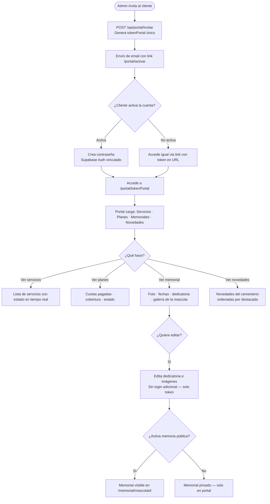
```mermaid
flowchart TD
    A([Admin invita al cliente]) --> B[POST /api/portal/invitar\nGenera tokenPortal único]
    B --> C[Envío de email con link /portal/activar]
    C --> D{¿Cliente activa la cuenta?}
    D -->|Activa| E[Crea contraseña\nSupabase Auth vinculado]
    D -->|No activa| F[Accede igual via link con token en URL]
    E --> G[Accede a /portal/tokenPortal]
    F --> G
    G --> H[Portal carga: Servicios · Planes · Memoriales · Novedades]
    H --> I{¿Qué hace?}
    I -->|Ver servicios| J[Lista de servicios con estado en tiempo real]
    I -->|Ver planes| K[Cuotas pagadas · cobertura · estado]
    I -->|Ver memorial| L[Foto · fechas · dedicatoria · galería de la mascota]
    L --> M{¿Quiere editar?}
    M -->|Sí| N[Edita dedicatoria e imágenes\nSin login adicional — solo token]
    N --> O{¿Activa memoria pública?}
    O -->|Sí| P[Memorial visible en /memorial/mascotaId]
    O -->|No| Q[Memorial privado — solo en portal]
    I -->|Ver novedades| R[Novedades del cementerio\nordenadas por destacada]
```

### 3i. Convenio B2B — Envío de Lead

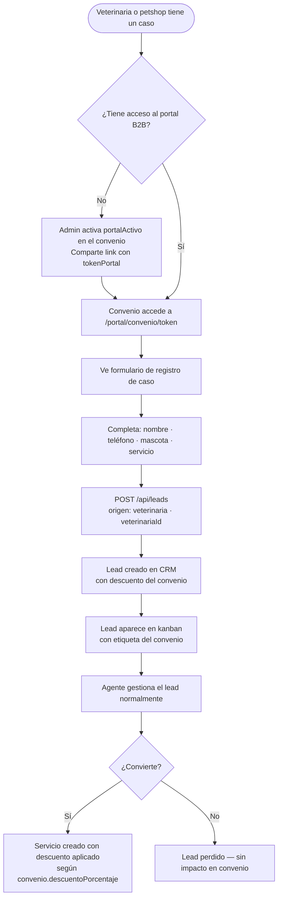
```mermaid
flowchart TD
    A([Veterinaria o petshop tiene un caso]) --> B{¿Tiene acceso al portal B2B?}
    B -->|No| C[Admin activa portalActivo en el convenio\nComparte link con tokenPortal]
    C --> D[Convenio accede a /portal/convenio/token]
    B -->|Sí| D
    D --> E[Ve formulario de registro de caso]
    E --> F[Completa: nombre · teléfono · mascota · servicio]
    F --> G[POST /api/leads\norigen: veterinaria · veterinariaId]
    G --> H[Lead creado en CRM\ncon descuento del convenio]
    H --> I[Lead aparece en kanban\ncon etiqueta del convenio]
    I --> J[Agente gestiona el lead normalmente]
    J --> K{¿Convierte?}
    K -->|Sí| L[Servicio creado con descuento aplicado\nsegún convenio.descuentoPorcentaje]
    K -->|No| M[Lead perdido — sin impacto en convenio]
```

### 3j. Gestión de Inventario

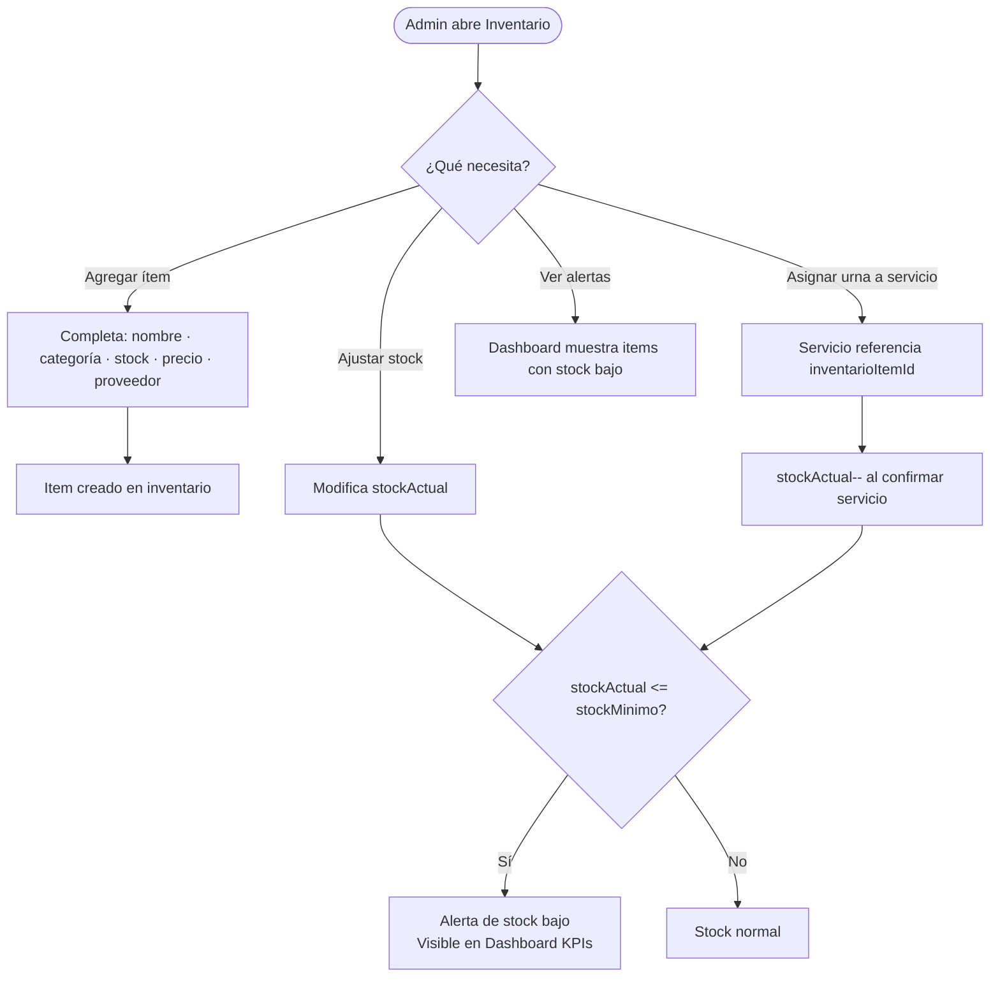
```mermaid
flowchart TD
    A([Admin abre Inventario]) --> B{¿Qué necesita?}
    B -->|Agregar ítem| C[Completa: nombre · categoría · stock · precio · proveedor]
    C --> D[Item creado en inventario]
    B -->|Ajustar stock| E[Modifica stockActual]
    E --> F{stockActual <= stockMinimo?}
    F -->|Sí| G[Alerta de stock bajo\nVisible en Dashboard KPIs]
    F -->|No| H[Stock normal]
    B -->|Asignar urna a servicio| I[Servicio referencia inventarioItemId]
    I --> J[stockActual-- al confirmar servicio]
    J --> F
    B -->|Ver alertas| K[Dashboard muestra items con stock bajo]
```

### 3k. Asistente IA Interno

```mermaid
flowchart TD
    A([Usuario abre el asistente IA]) --> B{¿Rate limit alcanzado?}
    B -->|Sí| C[Mensaje: límite por minuto alcanzado]
    B -->|No| D{¿Presupuesto mensual superado?}
    D -->|Sí| E[Mensaje: presupuesto agotado por este mes]
    D -->|No| F[Usuario escribe pregunta sobre el negocio]
    F --> G[POST /api/asistente/chat\npregunta · screenContext]
    G --> H[API construye prompt con contexto del negocio]
    H --> I[Llama a Claude Haiku via Anthropic API]
    I --> J[Respuesta recibida]
    J --> K[INSERT asistente_log\ntokensInput · tokensOutput · costo]
    K --> L[Usuario ve la respuesta]
    L --> M{¿Admin quiere auditar?}
    M -->|Sí| N[/dashboard/asistente\nVe logs · tokens acumulados · costo total]
```

---

## 4. Máquinas de Estado

### 4a. Estados de un Lead

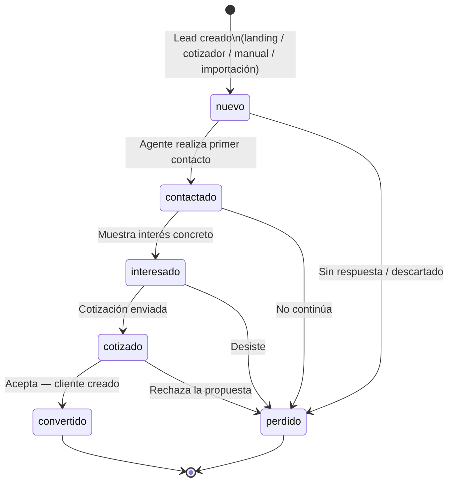
```mermaid
stateDiagram-v2
    [*] --> nuevo : Lead creado\n(landing / cotizador / manual / importación)

    nuevo --> contactado : Agente realiza primer contacto
    nuevo --> perdido : Sin respuesta / descartado

    contactado --> interesado : Muestra interés concreto
    contactado --> perdido : No continúa

    interesado --> cotizado : Cotización enviada
    interesado --> perdido : Desiste

    cotizado --> convertido : Acepta — cliente creado
    cotizado --> perdido : Rechaza la propuesta

    convertido --> [*]
    perdido --> [*]
```

### 4b. Estados de un Servicio

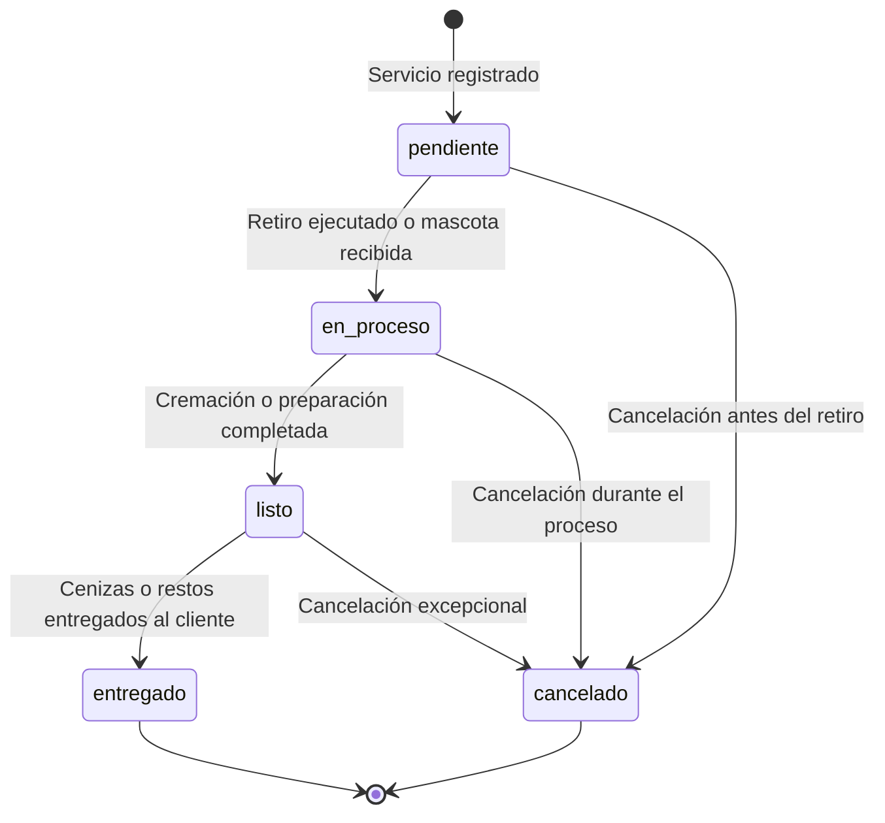
```mermaid
stateDiagram-v2
    [*] --> pendiente : Servicio registrado

    pendiente --> en_proceso : Retiro ejecutado o mascota recibida
    pendiente --> cancelado : Cancelación antes del retiro

    en_proceso --> listo : Cremación o preparación completada
    en_proceso --> cancelado : Cancelación durante el proceso

    listo --> entregado : Cenizas o restos entregados al cliente
    listo --> cancelado : Cancelación excepcional

    entregado --> [*]
    cancelado --> [*]
```

### 4c. Estados de un Plan de Previsión

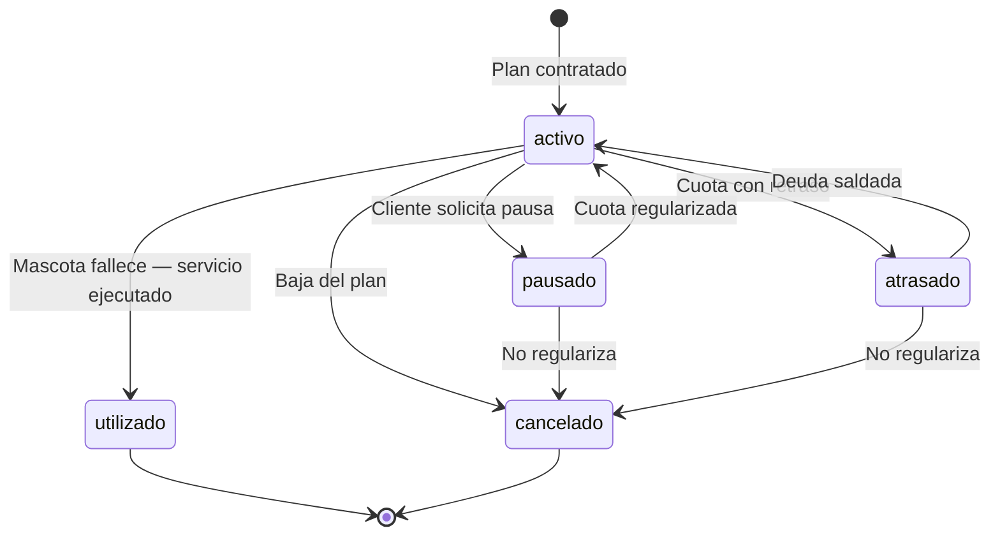
```mermaid
stateDiagram-v2
    [*] --> activo : Plan contratado

    activo --> pausado : Cliente solicita pausa
    activo --> atrasado : Cuota con retraso
    activo --> utilizado : Mascota fallece — servicio ejecutado
    activo --> cancelado : Baja del plan

    pausado --> activo : Cuota regularizada
    pausado --> cancelado : No regulariza

    atrasado --> activo : Deuda saldada
    atrasado --> cancelado : No regulariza

    utilizado --> [*]
    cancelado --> [*]
```

### 4d. Estados de un Convenio B2B

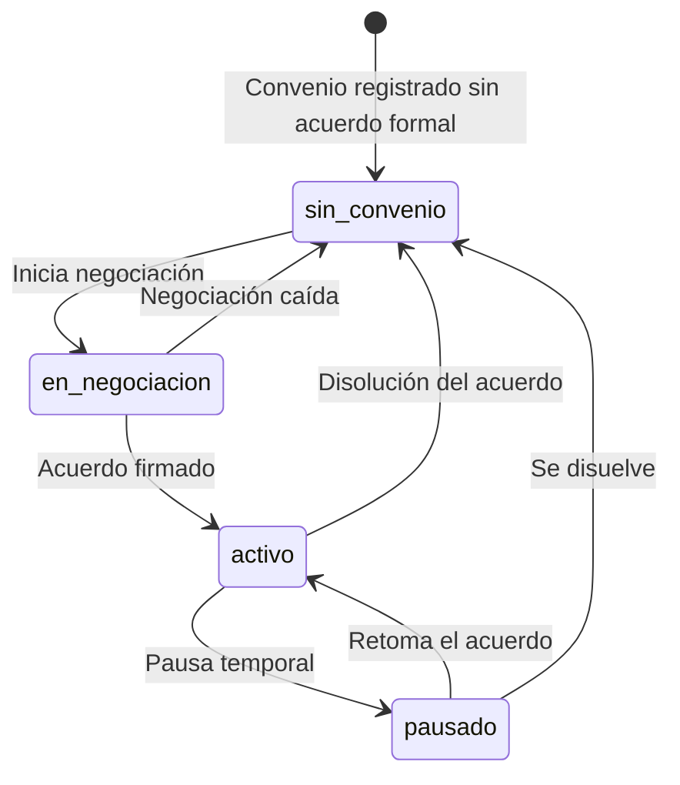
```mermaid
stateDiagram-v2
    [*] --> sin_convenio : Convenio registrado sin acuerdo formal

    sin_convenio --> en_negociacion : Inicia negociación
    en_negociacion --> activo : Acuerdo firmado
    en_negociacion --> sin_convenio : Negociación caída

    activo --> pausado : Pausa temporal
    pausado --> activo : Retoma el acuerdo
    pausado --> sin_convenio : Se disuelve

    activo --> sin_convenio : Disolución del acuerdo
```

### 4e. Estados de una Comunicación

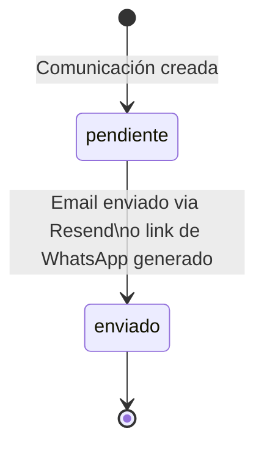
```mermaid
stateDiagram-v2
    [*] --> pendiente : Comunicación creada

    pendiente --> enviado : Email enviado via Resend\no link de WhatsApp generado

    enviado --> [*]
```

### 4f. Sesión MFA (2FA por Email OTP)

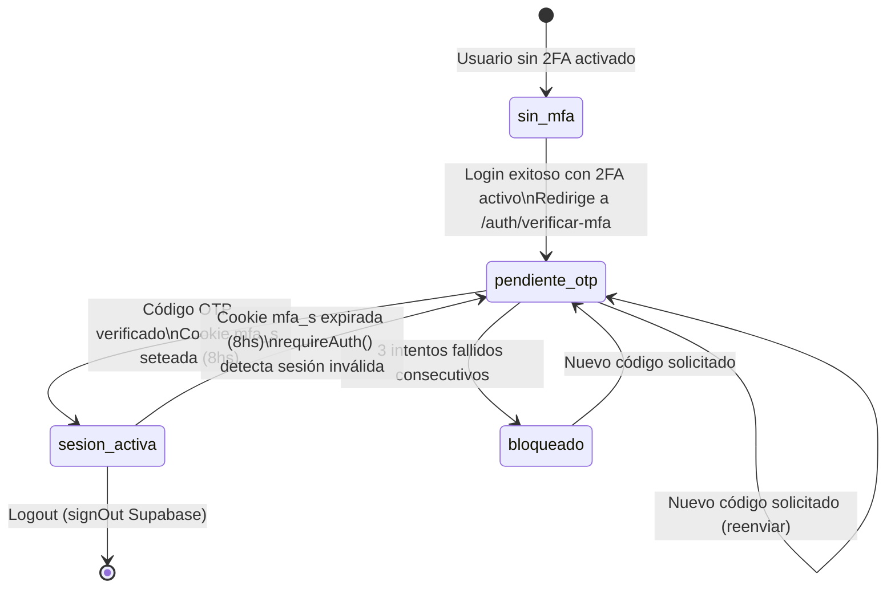
```mermaid
stateDiagram-v2
    [*] --> sin_mfa : Usuario sin 2FA activado

    sin_mfa --> pendiente_otp : Login exitoso con 2FA activo\nRedirige a /auth/verificar-mfa

    pendiente_otp --> sesion_activa : Código OTP verificado\nCookie mfa_s seteada (8hs)
    pendiente_otp --> bloqueado : 3 intentos fallidos consecutivos
    pendiente_otp --> pendiente_otp : Nuevo código solicitado (reenviar)

    bloqueado --> pendiente_otp : Nuevo código solicitado

    sesion_activa --> pendiente_otp : Cookie mfa_s expirada (8hs)\nrequireAuth() detecta sesión inválida
    sesion_activa --> [*] : Logout (signOut Supabase)
```

### 4g. Estado de Stock del Inventario

```mermaid
stateDiagram-v2
    [*] --> normal : Item creado con stock inicial

    normal --> bajo : stockActual cae por debajo de stockMinimo
    bajo --> normal : Stock reabastecido

    normal --> sinStock : stockActual llega a 0
    bajo --> sinStock : stockActual llega a 0
    sinStock --> normal : Stock reabastecido

    note right of bajo
        Aparece en Dashboard KPIs
        como alerta visible
    end note
```

---

## 5. Diagramas de Secuencia

### 5a. Cotizador → Lead en CRM

```mermaid
sequenceDiagram
    actor Visitante
    participant COT as Cotizador (iframe)
    participant API as CRM API
    participant DB as Supabase DB

    Visitante->>COT: Navega los 7 pasos del cotizador
    Note over COT: Tipo · Tamaño · Servicio · Retiro · Zona · Datos · Confirmación

    COT->>API: POST /api/leads { nombre, telefono, origen: "cotizador", mensaje: "Mascota: ... · Servicio: ..." }
    Note over API: Valida CORS — solo permite dominios autorizados
    API->>DB: INSERT leads (estado: "nuevo")
    DB-->>API: lead creado
    API-->>COT: { ok: true }
    COT-->>Visitante: Pantalla de éxito — "Te contactamos pronto"

    Note over DB: Lead aparece en kanban de Leads
    Note over DB: Estado: nuevo · Sin asignar
```

### 5b. Gestión de Lead → Conversión en Cliente

```mermaid
sequenceDiagram
    actor Agente as Agente (Televenta)
    participant UI as Browser — Gestión
    participant API as CRM API
    participant DB as Supabase DB
    participant Email as Resend

    Agente->>UI: Abre /dashboard/mis-leads
    UI->>API: GET /api/leads?misLeads=true
    Note over API: Filtra: estado activo AND seguimientoEn IS NULL OR seguimientoEn <= now()
    API->>DB: SELECT leads WHERE asignado_a_id = me
    DB-->>API: leads[]
    API-->>UI: Lista de leads activos
    UI-->>Agente: Muestra primer lead en cola

    Agente->>UI: Programa seguimiento en +30 min
    UI-->>Agente: Lead desaparece de la cola (optimistic)
    UI->>API: PATCH /api/leads/{id} { seguimientoEn: T+30min }
    API->>DB: UPDATE leads + INSERT interaccion (seguimiento)

    Note over UI,DB: 30 minutos después — polling cada 30s
    UI->>API: GET /api/leads?misLeads=true
    DB-->>API: Lead incluido (seguimientoEn <= now)
    API-->>UI: Lead reaparece en cola

    Agente->>UI: Confirma conversión
    UI->>API: POST /api/leads/convertir { leadId, nombre, mascotaNombre, tipo: "plan" }
    API->>DB: INSERT clientes
    API->>DB: INSERT mascotas
    API->>DB: INSERT planes
    API->>DB: UPDATE leads SET estado = "convertido"
    DB-->>API: { clienteId, mascotaId, planId }
    API->>Email: Enviar invitación al portal
    API-->>UI: { ok: true, clienteId }
    UI-->>Agente: Redirige a /dashboard/clientes/{clienteId}
```

### 5c. Servicio de Cremación — Flujo Multi-Rol

```mermaid
sequenceDiagram
    actor Admin
    actor Trans as Agente Transporte
    actor Crem as Agente Cremación
    actor Entre as Agente Entrega
    participant API as CRM API
    participant DB as Supabase DB
    participant Email as Resend

    Admin->>API: POST /api/servicios { clienteId, mascotaId, tipo, modalidadRetiro }
    API->>DB: INSERT servicios (estado: "pendiente")
    DB-->>API: { servicioId, numero }
    API-->>Admin: Servicio creado

    Trans->>API: GET /api/servicios?estado=pendiente (agenda)
    DB-->>API: servicios pendientes
    API-->>Trans: Lista de retiros

    Trans->>API: PATCH /api/servicios/{id} { estado: "en_proceso", fechaRetiro: now() }
    API->>DB: UPDATE servicios + responsable_transporte_id

    Crem->>API: GET /api/servicios?estado=en_proceso
    Crem->>API: PATCH /api/servicios/{id} { estado: "listo", fechaCremacion: now() }
    API->>DB: UPDATE servicios + responsable_cremacion_id
    API->>Email: Notificar al cliente — servicio listo

    Entre->>API: GET /api/servicios?estado=listo
    Entre->>API: PATCH /api/servicios/{id} { estado: "entregado", fechaEntrega: now(), pagado: true }
    API->>DB: UPDATE servicios + responsable_entrega_id
    API-->>Entre: Servicio cerrado

    Note over DB: Cliente ve estado "entregado" en su portal
```

### 5d. Portal del Cliente — Invitación y Acceso

```mermaid
sequenceDiagram
    actor Admin
    actor Cliente as Cliente (dueño)
    participant API as CRM API
    participant Auth as Supabase Auth
    participant DB as Supabase DB
    participant Email as Resend

    Admin->>API: POST /api/portal/invitar { clienteId }
    API->>DB: SELECT cliente (tokenPortal, email)
    API->>Email: Enviar link /portal/activar?token={tokenPortal}
    Email-->>Cliente: Email de invitación

    Cliente->>API: GET /portal/activar?token=...
    API->>DB: SELECT cliente WHERE token_portal = token
    DB-->>API: cliente encontrado

    Cliente->>API: POST /portal/activar { token, email, password }
    API->>Auth: Crear usuario Supabase Auth
    Auth-->>API: { userId }
    API->>DB: UPDATE clientes SET auth_user_id = userId
    API-->>Cliente: Redirige a /portal/{tokenPortal}

    Cliente->>API: GET /api/portal/{token}/data
    API->>DB: SELECT cliente + mascotas + servicios + planes + novedades
    DB-->>API: datos completos
    API-->>Cliente: Portal con tabs Servicios · Planes · Memorial · Novedades

    Cliente->>API: PATCH /api/mascotas/{id} { dedicatoria, memoriaPublica: true }
    API->>DB: UPDATE mascotas
    Note over DB: Memorial visible en /memorial/{mascotaId}
```

### 5e. Importación Masiva de Leads

```mermaid
sequenceDiagram
    actor Admin
    participant UI as Browser — Importar Leads
    participant API as CRM API
    participant XLSX as Parser XLSX
    participant DB as Supabase DB

    Admin->>UI: Sube archivo .xlsx
    UI->>API: POST /api/leads/importar (multipart/form-data)
    API->>XLSX: Parsear archivo Excel
    XLSX-->>API: rows[] con datos de cada fila

    loop Por cada fila
        API->>DB: SELECT lead WHERE telefono = row.telefono
        alt Duplicado encontrado
            DB-->>API: lead existente
            Note over API: Omite fila — contabiliza duplicado
        else Lead nuevo
            API->>DB: INSERT leads { origen: "importacion", importacionId }
            Note over API: Contabiliza importado
        end
    end

    API->>DB: INSERT importaciones_leads { totalImportados, totalDuplicados, totalErrores }
    DB-->>API: importacion registrada
    API-->>UI: { importados: N, duplicados: M, errores: 0 }
    UI-->>Admin: Resumen de la importación
```

### 5f. Asistente IA Interno

```mermaid
sequenceDiagram
    actor Admin
    participant UI as Browser — Asistente
    participant API as CRM API
    participant RL as Rate Limiter
    participant Claude as Anthropic API
    participant DB as Supabase DB

    Admin->>UI: Escribe pregunta sobre el negocio
    UI->>API: POST /api/asistente/chat { pregunta, screenContext }

    API->>RL: Verificar rate limit (req/min por usuario)
    alt Límite alcanzado
        RL-->>API: bloqueado
        API-->>UI: 429 — límite por minuto alcanzado
    else OK
        RL-->>API: permitido
    end

    API->>DB: SELECT SUM(costo) FROM asistente_log WHERE mes = actual
    alt Presupuesto agotado
        DB-->>API: costo > PRESUPUESTO_USD
        API-->>UI: 403 — presupuesto mensual agotado
    else OK
        DB-->>API: dentro del presupuesto
    end

    API->>Claude: POST completions { model: haiku, messages, system }
    Claude-->>API: respuesta + tokens usados

    API->>DB: INSERT asistente_log { tokensInput, tokensOutput, costo }
    API-->>UI: { respuesta, tokensUsados }
    UI-->>Admin: Muestra respuesta del asistente

    Note over Admin: /dashboard/asistente muestra\nlogs · tokens acumulados · costo total mensual
```

### 5g. Autenticación 2FA por Email OTP

```mermaid
sequenceDiagram
    actor Agente
    participant UI as Browser — Login
    participant API as CRM API
    participant Auth as Supabase Auth
    participant DB as Supabase DB
    participant Email as Resend

    Agente->>UI: Ingresa email + contraseña en /auth/login
    UI->>Auth: signInWithPassword(email, password)
    Auth-->>UI: session OK

    UI->>API: GET /api/me (verifica si 2FA está activo)
    API->>DB: SELECT usuarios WHERE auth_user_id = session.userId
    DB-->>API: usuario { mfaEmailActivo: true }
    API-->>UI: { mfaRequerido: true }

    UI-->>Agente: Redirige a /auth/verificar-mfa

    Note over UI: La página auto-ejecuta el envío de OTP al montar
    UI->>API: POST /api/auth/otp/enviar (skipMfa=true)
    API->>DB: Genera código 6 dígitos · Hash SHA-256(codigo+userId)
    API->>DB: UPDATE usuarios SET otp_codigo=hash, otp_expira_en=+10min, otp_intentos=0
    API->>Email: Resend — "Tu código de verificación: XXXXXX"
    Email-->>Agente: Email con código OTP

    Agente->>UI: Ingresa los 6 dígitos
    UI->>API: POST /api/auth/otp/verificar { codigo } (skipMfa=true)
    API->>DB: SELECT usuario (otpCodigo, otpExpiraEn, otpIntentos)

    alt Expirado
        API-->>UI: 400 — Código expirado, solicitá uno nuevo
    else Intentos >= 3
        API-->>UI: 429 — Demasiados intentos, solicitá uno nuevo
    else Código inválido
        API->>DB: UPDATE otp_intentos++
        API-->>UI: 400 — Código incorrecto (N intentos restantes)
    else Código válido
        API->>DB: Genera mfaSesionToken · UPDATE usuarios SET mfa_sesion_token=token, mfa_sesion_expira_en=+8hs, otp_codigo=null
        API-->>UI: Set-Cookie mfa_s={userId}:{token} (httpOnly, 8hs)
        API-->>UI: { ok: true }
        UI-->>Agente: Redirige a /dashboard
    end

    Note over API,DB: En cada request al dashboard: requireAuth() valida mfa_s cookie.<br/>Si expira (8hs) → redirige a /auth/verificar-mfa automáticamente.
```

### 5h. Convenio B2B — Lead desde el Portal

```mermaid
sequenceDiagram
    actor Convenio as Socio B2B (veterinaria)
    participant Portal as Portal B2B
    participant API as CRM API
    participant DB as Supabase DB

    Note over Convenio: Admin activó portalActivo = true\ny compartió el link con tokenPortal

    Convenio->>Portal: Accede a /portal/convenio/{tokenPortal}
    Portal->>API: GET /api/convenios/portal/{token}
    API->>DB: SELECT convenio WHERE token_portal = token AND portal_activo = true
    DB-->>API: convenio con descuentoPorcentaje y serviciosCubiertos
    API-->>Portal: Datos del convenio

    Convenio->>Portal: Completa formulario: nombre · teléfono · mascota · tipo de servicio
    Portal->>API: POST /api/leads { nombre, telefono, origen: "veterinaria", veterinariaId }
    API->>DB: INSERT leads (estado: "nuevo", veterinaria_id)
    DB-->>API: lead creado
    API-->>Portal: { ok: true }
    Portal-->>Convenio: Confirmación — el equipo se contactará pronto

    Note over DB: Lead aparece en kanban con etiqueta del convenio
    Note over DB: Al convertir: servicio creado\ncon descuento del convenio aplicado
```

---

## Tablas del sistema — Referencia completa

| Tabla | Entidades | Descripción |
|---|---|---|
| `usuarios` | Usuario | Equipo interno — roles y permisos adicionales |
| `leads` | Lead | Prospectos de todos los canales de captación |
| `lead_interacciones` | LeadInteraccion | Historial completo de acciones sobre cada lead |
| `importaciones_leads` | ImportacionLead | Registro de lotes de importación masiva desde Excel |
| `clientes` | Cliente | Dueños de mascotas registrados en el sistema |
| `mascotas` | Mascota | Mascotas — galería, dedicatoria y memorial público |
| `servicios` | Servicio | Servicios de cremación o entierro con ciclo completo |
| `servicios_config` | ServicioConfig | Templates configurables de tipos de servicio con precios |
| `planes` | Plan | Planes de previsión contratados con cobertura escalonada |
| `planes_config` | PlanConfig | Templates de planes con cobertura escalonada configurable |
| `convenios` | Convenio | Socios B2B — veterinarias, petshops, refugios, clínicas |
| `inventario` | Inventario | Stock de urnas, insumos y accesorios con alertas |
| `comunicaciones` | Comunicacion | Log de mensajes enviados a clientes |
| `templates_msg` | TemplateMsg | Plantillas de WhatsApp/email por tipo de evento |
| `noticias_cementerio` | NoticiaCementerio | Novedades del portal — borrador/publicado/destacado |
| `configuracion_general` | ConfiguracionGeneral | Settings clave/valor del sistema en JSONB |
| `asistente_log` | AsistenteLog | Auditoría del asistente IA — tokens y costos |
